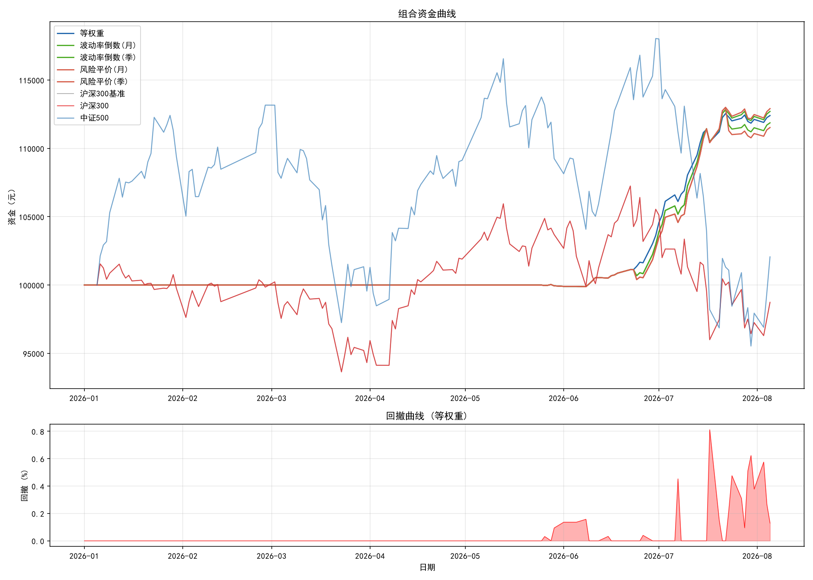

## 📈 A股LSTM量化交易系统
基于 LSTM 神经网络 的 A 股市场量化策略回测与交易系统，支持全市场选股、多窗口交叉验证、组合回测与绩效分析。

## 🚀 核心特性
全流程自动化：数据下载 → 特征工程 → 模型训练 → 回测验证 → 白名单生成 → 组合优化，一键运行
扩展窗口交叉验证：6个时间窗口（2021-2026年）验证策略稳健性，确保不过拟合
实战化回测引擎：支持交易成本（佣金、印花税、滑点）、止盈止损、仓位管理
高质量白名单生成：基于最终模型筛选强势股，2025-2026年组合回测收益 25.54%，最大回撤仅 0.92%
实时结果写入：边回测边写入 CSV，程序中断也不丢失数据

## 🛠️ 技术栈

| 类别 | 技术 |
| :--- | :--- |
| **深度学习框架** | PyTorch 2.x（CUDA） |
| **数据源** | baostock（本地缓存） |
| **数据处理** | Pandas、NumPy、Scikit-learn |
| **可视化** | Matplotlib、Seaborn |
| **模型持久化** | joblib |

## 📁 项目结构

```text
.
├── config/                      # 全局配置
│   ├── __init__.py
│   └── settings.py              # 所有参数（阈值、路径、特征列表）
├── core/                        # 核心功能模块
│   ├── __init__.py
│   ├── data_loader.py           # 数据下载、缓存、增量更新
│   ├── features.py              # 特征构造（技术指标、目标变量）
│   ├── model.py                 # LSTM 模型定义
│   ├── trainer.py               # 模型训练（早停、验证集划分）
│   ├── backtest_engine.py       # 回测引擎（交易成本、信号生成）
│   └── metrics.py               # 绩效指标（夏普、回撤等）
├── scripts/                     # 可执行脚本
│   ├── batch_backtest.py        # 扩展窗口交叉验证 + 最终模型训练
│   ├── train_final_model.py     # 单独训练最终模型
│   └── pool_backtest_analysis.py # 组合回测与绩效分析
├── utils/                       # 工具函数
│   ├── __init__.py
│   ├── common.py                # 随机种子、序列生成
│   └── logger.py                # 日志配置
├── logs/                        # 日志文件（自动生成）
├── stock_data_cache/            # 股票数据缓存（Parquet 格式）
├── requirements.txt             # 依赖列表
├── .gitignore
└── README.md
```


## 📊 运行流程

```text

1. 首次运行：下载数据并训练模型
bash
pip install -r requirements.txt
python scripts/batch_backtest.py
自动下载 A 股列表，过滤北交所和 ST 股票。
下载每只股票的历史数据（优先缓存，支持增量更新）。
执行 扩展窗口交叉验证（默认 3 个窗口，可调整 NUM_WINDOWS）。
最后训练 最终模型（使用全部历史数据）。

2. 仅训练最终模型（跳过窗口验证）
bash
python scripts/train_final_model.py --stocks 6000 --end-date 2026-08-04
3. 组合回测（对白名单股票进行等权重组合）
bash
python scripts/pool_backtest_analysis.py
加载 whitelist_extended.csv 中的股票。
使用最终模型进行组合回测，计算组合收益、夏普、最大回撤。
生成资金曲线图和绩效指标 CSV。
```


## 🔍 结果文件说明

```text
window_1_results.csv ~ window_N_results.csv：每个窗口的逐股票回测结果（包含收益率、夏普、回撤、交易次数等）。
expanding_window_summary.csv：各窗口的汇总统计（平均收益、胜率、夏普、回撤、有效股票数）。
model_final.pth：最终生产模型（包含全部历史数据）。
scaler_X_final.pkl、scaler_Y_final.pkl：标准化器（用于新数据预处理）。
pool_backtest_results.csv：组合回测的股票贡献明细。
pool_metrics.csv：组合的绩效指标。
```

## ⚙️ 关键参数调优建议

```text
参数	含义	调优方向
BUY_THRESHOLD	买入概率阈值	提高→减少假信号，降低→捕捉更多机会
STOP_LOSS	止损比例	收紧→控制单笔亏损，放宽→给更多空间
TAKE_PROFIT	止盈比例	降低→更快锁定利润，提高→让利润奔跑
MAX_POSITION	单只股票最大仓位	降低→分散风险，提高→集中押注
SEQ_LEN	序列长度（交易日）	10~30，影响时间窗口
HIDDEN_SIZE	LSTM 隐藏层维度	64/128，越大模型容量越大
```

## 📈 回测结果（关键数据）
```text
扩展窗口交叉验证（2021-2026年）
窗口	测试年份	市场环境	平均收益率	胜率	平均最大回撤
1	2021	震荡偏牛	+1.70%	61.79%	2.84%
2	2022	大熊市	+0.95%	55.56%	2.58%
3	2023	AI牛市	-0.28%	38.82%	2.55%
4	2024	震荡修复	+1.71%	62.95%	4.93%
5	2025	稳健上行	+1.87%	69.05%	2.17%
6	2026(至8月)	震荡偏弱	-0.31%	36.14%	2.49%
核心结论：策略在 2022 年大熊市中依然实现正收益（0.95%），具备极强的防守能力。

白名单统计（30只）
指标	数值
平均收益率	18.79%
平均最大回撤	3.25%
平均夏普比率	1.588
组合回测（2025年1月 ~ 2026年8月）
指标	数值
组合总收益	25.54%
年化收益率	~15.3%
最大回撤	0.92%
回测周期	20个月
白名单前10名：

代码	名称	收益率	夏普比率	最大回撤
688585	上纬新材	52.6%	2.509	5.4%
300626	华瑞股份	28.7%	2.540	3.7%
688171	纬德信息	28.5%	1.580	3.3%
688498	源杰科技	27.4%	1.902	7.1%
300502	新易盛	27.3%	2.100	3.1%
```
## 📈 组合资金曲线



## 📖 常见问题

```text
1. 数据下载失败或超时？
检查网络，或改用 akshare 作为主数据源（在 core/data_loader.py 中调整优先级）。
若频繁超时，可降低 max_workers 或增加 timeout。

2. 模型训练太慢？
减少 TRAIN_STOCKS（训练股票数）。
启用混合精度训练（在 trainer.py 中启用 autocast）。
使用 GPU（CUDA）加速。

3. zip() argument 2 is longer than argument 1 错误？
确保模型定义（core/model.py）与保存的权重一致（HIDDEN_SIZE、NUM_LAYERS）。
在 run_window_backtest 中已采用保存整个模型对象的方式，该错误不应再出现。

4. 如何查看单只股票的回测详情？
运行 test.py（需自行创建），加载 model_final.pth，对指定股票进行回测并输出交易明细。

5. 如何扩展新特征？
在 config/settings.py 的 FEATURE_COLS 中添加新列名
在 core/features.py 的 construct_features 函数中实现计算逻辑。
运行 reconstruct_all_features()（在 data_loader.py 中）重建缓存特征，无需重新下载数据。

6. 白名单为空？
降低 WHITELIST_MIN_RETURN 阈值（如 0.05）。
延长回测区间（如 BACKTEST_START = "2025-01-01"）。

7. PyTorch 2.6 加载模型报错？
在 torch.load() 中添加 weights_only=False：
python
model = torch.load(model_path, map_location=device, weights_only=False)
```

**⚠️ 免责声明：本项目仅供量化研究与学习使用，不构成任何投资建议。实盘交易需谨慎，风险自负。**

## License

This project is licensed under the Apache License, Version 2.0 - see the [LICENSE](LICENSE) file for details.